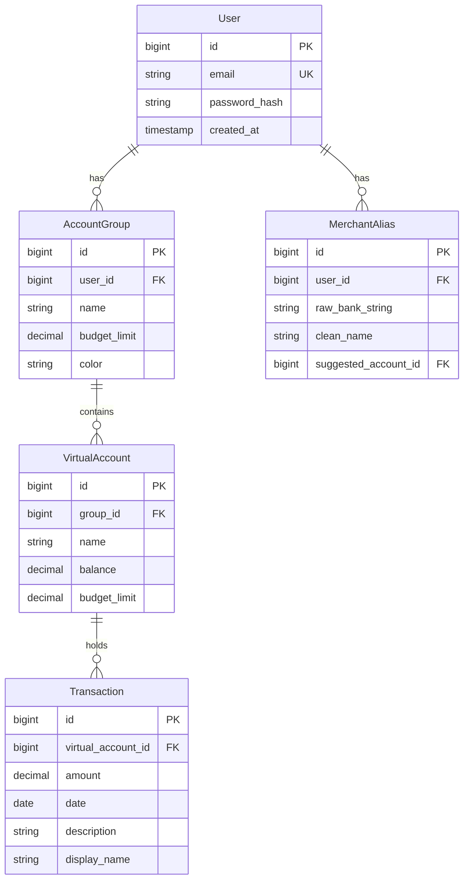

# Conto — Entity-Relationship Diagram (MVP)

> This ERD covers Sprints 1–4 only. Post-MVP entities (BankAccount, BankProfile, ImportBatch, PendingTransaction, TransactionSplit, GroceryLineItem, RecurringTransfer) will be added as their sprints begin.

